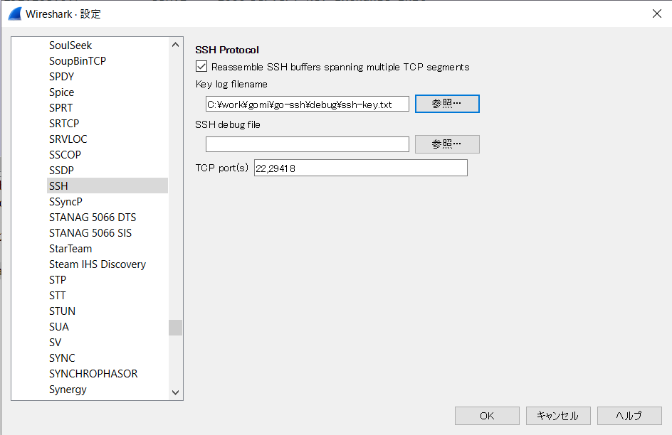

# go-ssh

### パケットの参照

- 以下より最新のWiresharkをインストール
  https://www.wireshark.org/download.html
- wiresharkを開き、編集 > 設定 > ProtocolでSSHを開く
- Key log filenameにdebugフォルダにある `ssh-keylog.txt`をセット

- 設定を反映させるためwiresharkを開きなおして、debugフォルダにあるpacpngファイルを開く

### SSHプロトコルの基礎知識

[SSHv2による接続からログインまでの流れ](https://www.alaxala.com/jp/techinfo/archive/manual/AX4600S/HTML/11_15_G/CFGUIDE/0183.HTM)

RFC
- [RFC4250](https://tex2e.github.io/rfc-translater/html/rfc4250.html)  
  メッセージ番号について
- [RFC4251](https://tex2e.github.io/rfc-translater/html/rfc4251.html)  
  SSHの仕組みについて
- [RFC4252](https://tex2e.github.io/rfc-translater/html/rfc4252.html)  
  認証プロトコルについて
- [RFC4253](https://tex2e.github.io/rfc-translater/html/rfc4253.html)  
  トランスポート層プロトコルについて  
- [RFC4254](https://tex2e.github.io/rfc-translater/html/rfc4254.html)  
  コネクションプロトコルについて

SSH接続の流れと各RFCの対応
1. サーバにTCP接続  
2. RFC4253 トランスポート層プロトコル  
2.1 バージョン文字列と各種暗号方式の交換  
2.2 ホスト認証と暗号化通信路の確立  
3. RFC4252 認証プロトコル  
3.1 ユーザ認証(公開鍵orパスワード)  
4. RFC4254 コネクションプロトコル  
4.1 コマンド実行orポートフォワードorx11転送
